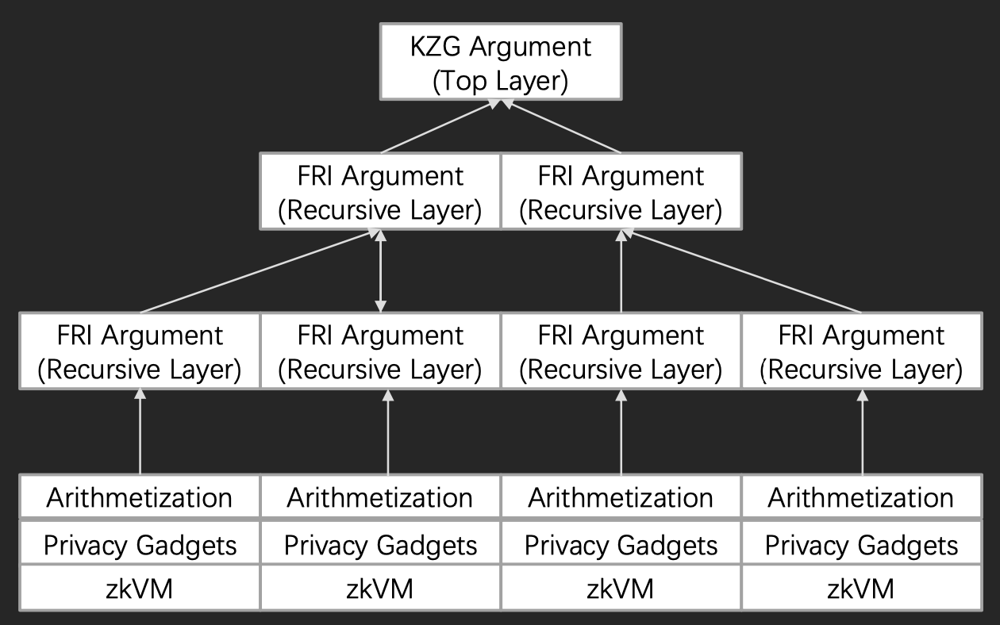

# eigen-zkvm

eigen-zkvm is a zkVM on layered proof system, allowing the developers to write Zero-knowledge applications, proving with the layered proof system to achieve no trusted setup, constant on-chain proof size and low gas cost, and finally generating the solidity verifier.

- [x] zkit: universal commandline for starky and plonky

- [x] Circom 2.x on PlonK prove system, with aggregation proof;

- [x] Generate solidity verifier;

- [x] GPU acceleration for proving, not opensourced; 

- [x] WASM friendly for single proving and verifying, NodeJS/Javascript prover and verifier, [plonkjs](https://github.com/0xEigenLabs/plonkjs)

- [x] Layered Proof system on Plonk and FRI.

- [] State Machine based VM

## How layered proof system works



## Tutorial
* Generate universal setup key
```
zkit setup -p 13 -s setup_2^13.key
```
For power in range 20 to 26, you can download directly from [universal-setup hub](https://universal-setup.ams3.digitaloceanspaces.com).

* Single proof
[test_single.sh](./test/test_single.sh)

* Aggregation proof
[test_aggregation.sh](./test/test_aggregation.sh)

* Stark proof and recursive stark prove
[starky](./starky)

* Layered proof
[starkjs](./starkjs)

## Applications
* [eigen-secret](https://github.com/0xEigenLabs/eigen-secret)